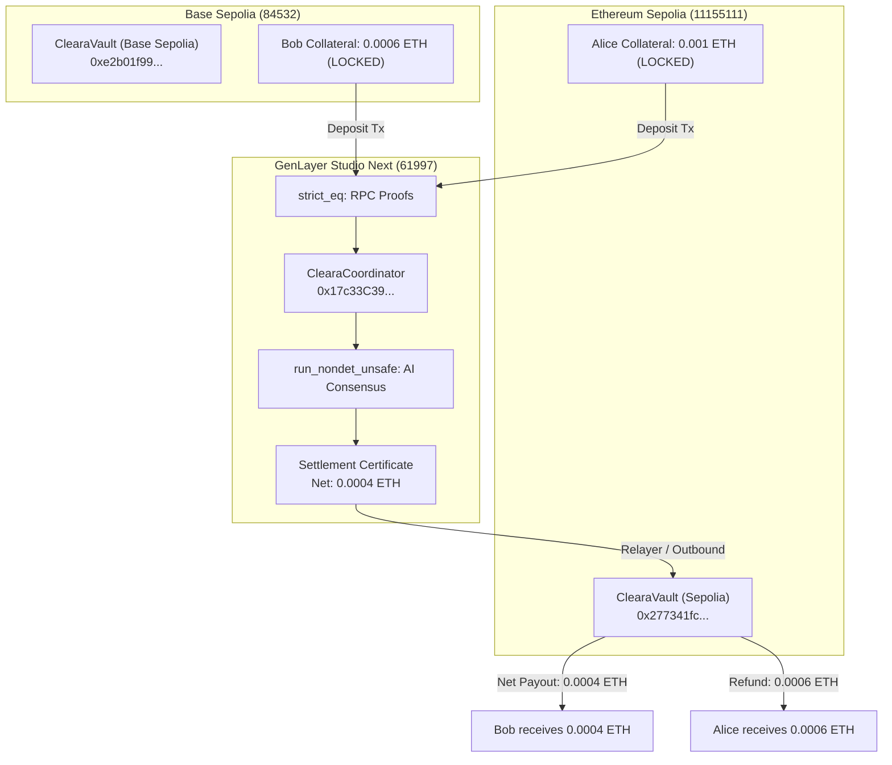

# Cleara on GenLayer — System Architecture

Cleara transforms cross-chain settlement by moving the heavy judgment of financial obligations into an on-chain AI adjudication layer (**GenLayer**), while keeping asset custody and final payouts strictly on native rails (**Ethereum Sepolia** and **Base Sepolia**).

```
"Clear first. Move only what remains."
```

---

## 1. System Topology



---

## 2. Core Epistemic Roles

| Layer | Component | Epistemic Responsibility |
|---|---|---|
| **Proof Substrate** | `strict_eq` RPC | Independently validates transaction hashes and inclusion against Sepolia & Base Sepolia without trusted bridges. |
| **Financial Grammar** | `cleara_coordinator.py` | Defines obligation dataclasses, balance bounds, and lifecycle state machines. |
| **Adjudication Engine** | Optimistic Democracy | AI evaluates natural-language terms, currency parity, and commercial reciprocity across counterparty claims. |
| **Canonical State** | GenLayer Contract Storage | Authoritative ledger maintaining unforgeable Settlement Certificates. |
| **Settlement Rails** | `ClearaVault.sol` (EVM) | Native execution contracts holding collateral and releasing funds based on finalized certificates. |

---

## 3. The 5-Stage Lifecycle

1. **Record (`record_obligation`):** Counterparties register reciprocal obligations with amount, currency, terms, and counterparty address.
2. **Verify (`verify_source_event`):** Multi-validator RPC verification asserts transaction receipts from Sepolia and Base Sepolia match expected depositors and values.
3. **Adjudicate (`evaluate_clearing`):** Leader proposes semantic clearing eligibility; committee validators re-evaluate prompts independently and assert hard reciprocity invariants.
4. **Certify (`get_settlement_certificate`):** GenLayer issues a cryptographically tamper-proof Settlement Certificate detailing the net residual.
5. **Execute (`unlockWithCertificate`):** Relayer presents the certificate to the native EVM Vault; the vault pays the net amount to the creditor and refunds the cleared portion to the debtor locally.

---

## 4. Equivalence Principle Specification

### Deterministic Subsystem: `strict_eq`
* **Target:** `eth_getTransactionReceipt` and `eth_getTransactionByHash`.
* **Execution:** Validators hit configured RPCs independently, canonicalizing responses into strict sorted JSON. If any byte differs, consensus fails.

### Non-Deterministic Subsystem: `run_nondet_unsafe`
* **Target:** Semantic contract interpretation (`_adjudicate_pair`).
* **Execution:** Leader calls `gl.nondet.exec_prompt`. Validators receive `leader_result`, independently re-run the prompt against the same evidence, and assert identical normalized decisions:
  * `eligible == true`
  * `mode == "BILATERAL_NETTING"`
  * `reciprocal == true` (Hard Invariant: `a.party_a == b.party_b && a.party_b == b.party_a`)
  * `net_atto_amount == abs(amount_a - amount_b)`
