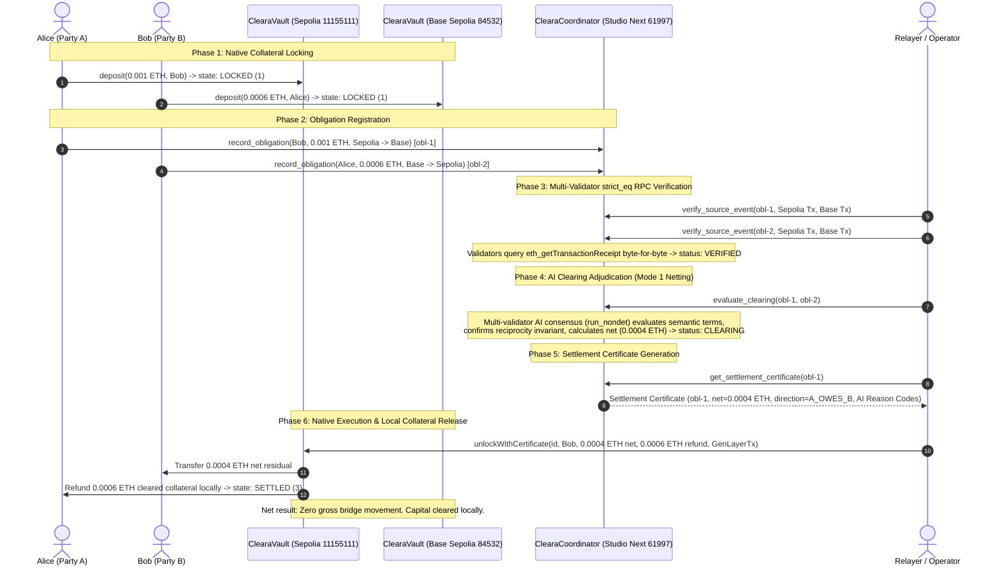

# Cleara on GenLayer

> **Proof-Native Multichain Financial Coordination & Bilateral Settlement Protocol**  
> *"Clear first. Move only what remains."*

[](#8-canonical-verification-pipeline)
[](https://studio-next.genlayer.com)
[](https://sepolia.etherscan.io)
[](https://sepolia.basescan.org)
[](BUILD_FOUNDRY.md)
[](LICENSE)

---

## 1. Protocol Thesis & Vision

### The Problem: Gross Multichain Settlement is Fundamentally Broken
In modern decentralized finance, moving value across chains requires **gross settlement through third-party bridges**. When Entity A owes $100M from Ethereum to Base, and Entity B owes $90M from Base to Ethereum, the current multichain paradigm routes **$190M of gross collateral across third-party bridge contracts**.

This architectural flaw has resulted in:
* **Over $3 Billion lost** in cross-chain bridge hacks and validator multisig exploits.
* **Massive capital inefficiency:** Fragmented liquidity pools across hundreds of chains and rollups.
* **Smart contract illiteracy:** Traditional EVM smart contracts are strictly deterministic calculators. They cannot read, interpret, or verify natural-language commercial terms, invoices, performance milestones, or master netting agreements.
* **Centralization trap:** To net obligations, institutions are forced back into centralized, opaque clearinghouses with counterparty risk.

### The Solution: Cleara on GenLayer
Cleara introduces a new primitive: **separating the semantic adjudication of financial relationships from the physical movement of collateral**.

```
Gross Multichain World (Legacy):
Alice (Sepolia) ──── gross 0.001 ETH via Bridge ───→ Bob (Base)
Bob (Base)      ──── gross 0.0006 ETH via Bridge ──→ Alice (Sepolia)
Total Bridge Risk: 0.0016 ETH exposed | Latency: High | Capital Locked: 100%

Cleara Netting World (GenLayer):
Alice & Bob lock collateral in sovereign local vaults (ClearaVault.sol)
                          ↓
GenLayer multi-validators verify receipts via strict_eq & net terms on-chain
                          ↓
Net Settlement: 0.0004 ETH released to Bob locally on Sepolia
Local Refund:   0.0006 ETH refunded to Alice locally on Sepolia
Total Bridge Risk: 0 ETH | Bridge Movement: ZERO | Capital Cleared: 60% locally
```

Instead of sending collateral across bridges, parties lock liquidity in sovereign native vaults on their respective home chains. **GenLayer's Optimistic Democracy** acts as the decentralized financial clearinghouse:
1. **Multi-Validator RPC Fact Verification (`strict_eq`):** Consensus validators independently query destination RPCs (`eth_getTransactionReceipt` & `eth_getTransactionByHash`) to verify deposit events byte-for-byte.
2. **On-Chain AI Adjudication (`run_nondet`):** Validators evaluate natural-language commercial terms, confirm reciprocal relationships, enforce hard deterministic invariants, and calculate exact net obligations.
3. **Cryptographic Settlement Certificates:** GenLayer issues an unforgeable certificate driving sovereign EVM execution vaults.
4. **Local Native Execution:** Sovereign vaults pay out only the net residual and refund cleared collateral locally. **Zero gross capital crosses a bridge.**

---

## 2. Why GenLayer's Primitive Is Essential

Cleara is impossible to build on Ethereum L1, Chainlink oracles, LayerZero, or standard ZK rollups:

| Dimension | Why Traditional Stacks Fail | How GenLayer Solves It |
|---|---|---|
| **Semantic Commercial Terms** | EVM smart contracts only compute deterministic math; they cannot interpret natural-language invoices, netting agreements, or performance covenants. | **Optimistic Democracy (`run_nondet`):** Multi-validator LLM consensus evaluates semantic relationship compatibility, asset equivalence, and commercial enforceability. |
| **Trustless Cross-Chain Evidence** | Oracles provide scalar price feeds; bridge relays rely on centralized multisigs or optimistic fraud windows. | **`strict_eq` RPC Verification:** Committee validators query `eth_getTransactionReceipt` across Sepolia and Base Sepolia, enforcing byte-level consensus without oracles. |
| **Decentralized Clearing Authority** | Centralized clearinghouses (DTCC, CLS) act as single points of failure with opaque balance sheets. | **Settlement Certificates:** Finalized GenLayer state acts as an on-chain cryptographic authority packet driving sovereign EVM vault execution. |
| **Built-in Dispute Escalation** | Smart contract disputes require clumsy DAO voting or administrative multisig overrides. | **Optimistic Escalation:** GenLayer's 5 → 7 → 11 → 23 validator committee escalation resolves contested adjudications cryptographically. |

---

## 3. End-to-End System Topology



---

## 4. The Three Settlement Modes

Cleara supports three distinct settlement execution paths:

### 🌟 Mode 1 — Bilateral Reciprocal Netting (Live Proven On-Chain)
* **What it is:** Two counterparties owe offsetting obligations on different chains. Cleara nets reciprocal amounts on-chain ($Gross \rightarrow Net$).
* **Concrete Numerical Walkthrough:**
  1. **Alice** owes Bob `0.001 ETH` on Ethereum Sepolia for compute infrastructure. She locks `0.001 ETH` in `ClearaVault` on Sepolia.
  2. **Bob** owes Alice `0.0006 ETH` on Base Sepolia for data ingestion. He locks `0.0006 ETH` in `ClearaVault` on Base Sepolia.
  3. **Gross Exposure:** `0.0016 ETH` would traditionally move across bridges.
  4. **GenLayer Resolution:** GenLayer verifies deposits via `strict_eq`, adjudicates the reciprocal relationship via AI consensus (`run_nondet`, Tx `0x6b8d3511...`, `FINISHED_WITH_RETURN`), and calculates the exact net debt:
     $$\text{Net Residual} = 0.001 - 0.0006 = 0.0004\text{ ETH (Alice owes Bob)}$$
  5. **Local Vault Execution:**
     * Bob receives `0.0004 ETH` net residual on Ethereum Sepolia.
     * Alice receives an immediate local refund of `0.0006 ETH` on Ethereum Sepolia.
     * Bob's collateral on Base Sepolia is released locally.
* **Impact:** **Zero tokens cross a bridge.** 60% of Alice's debt and 100% of Bob's debt are cleared with zero multichain slippage and zero bridge risk.

### Mode 2 — Facility / LP Fronting & Collateral Claim
* **What it is:** For urgent, high-frequency, or asymmetric payouts where immediate destination liquidity is required.
* **Execution:**
  1. Alice locks collateral in `ClearaVault` on Chain A.
  2. An approved Liquidity Provider (LP) registered in `ClearaFacilityManager` fronts immediate native funds to Bob locally on Chain B.
  3. GenLayer verifies the fulfillment and issues a Settlement Certificate.
  4. The LP claims the locked collateral on Chain A using the finalized certificate.
* **Impact:** Instant cross-chain settlement with zero bridge latency, backed by decentralized credit facilities.

### Mode 3 — Residual Bridge Routing
* **What it is:** When residual non-reciprocal debt cannot be netted and must be physically bridged.
* **Execution:**
  1. The vault interfaces with canonical native bridges (e.g. OP Standard Bridge or Arbitrum Native Bridge) via `MockBridgeAdapter.sol`.
  2. Only the unnetted residual moves through the bridge.
* **Impact:** Eliminates third-party wrapped bridge risks by restricting bridge volume to minimal net residuals.

---

## 5. Live Multichain Proving Evidence (Mode 1 Netting)

The complete Mode 1 Bilateral Netting lifecycle was executed across live testnets and recorded in [`foundry/evidence/live-lifecycle.log`](foundry/evidence/live-lifecycle.log):

| Step | Operation | Network | Entity / Tx Hash | On-Chain Result |
|---|---|---|---|---|
| **1** | Collateral Lock | Sepolia (`11155111`) | Alice (`0x85B5...`) | `0.001 ETH` in state `1` (`LOCKED`) |
| **1** | Collateral Lock | Base Sepolia (`84532`) | Bob (`0x7099...`) | `0.0006 ETH` in state `1` (`LOCKED`) |
| **2** | Record Obligation 1 | Studio Next (`61997`) | [`0x3ceb35c7...`](foundry/evidence/live-lifecycle.log) | `obl-1` registered (`ACCEPTED`, `FINISHED_WITH_RETURN`) |
| **2** | Record Obligation 2 | Studio Next (`61997`) | [`0x2bfdd2a4...`](foundry/evidence/live-lifecycle.log) | `obl-2` registered (`ACCEPTED`, `FINISHED_WITH_RETURN`) |
| **3** | `strict_eq` Proof (Sepolia) | Studio Next (`61997`) | [`0xd65370cb...`](foundry/evidence/live-lifecycle.log) | Receipt verified byte-for-byte by validators |
| **3** | `strict_eq` Proof (Base) | Studio Next (`61997`) | [`0xfceab825...`](foundry/evidence/live-lifecycle.log) | Receipt verified byte-for-byte by validators |
| **3** | `strict_eq` Proof (Sepolia) | Studio Next (`61997`) | [`0x29b59e1d...`](foundry/evidence/live-lifecycle.log) | Counterparty receipt verified |
| **3** | `strict_eq` Proof (Base) | Studio Next (`61997`) | [`0xd8972223...`](foundry/evidence/live-lifecycle.log) | Counterparty receipt verified -> `status: VERIFIED` |
| **4** | **AI Netting Adjudication** | **Studio Next (`61997`)** | [`0x6b8d3511...`](foundry/evidence/live-lifecycle.log) | **`status=5`, `FINISHED_WITH_RETURN` -> Net `0.0004 ETH`, `A_OWES_B`** |
| **5** | Settlement Certificate | Studio Next (`61997`) | Contract `0xF75595...` | Emitted with AI Reason Codes and cryptographic proofs |
| **6** | **Native Vault Unlock** | **Ethereum Sepolia** | [`0xd2d14af0...`](https://sepolia.etherscan.io/tx/0xd2d14af06b39f8ab9940c86507032b7f2412af9e96fb018d2aaff6acba59632b) | **Block `11723829`: Status `success` -> State `3` (`SETTLED`)** |

---

## 6. Verified Deployed Infrastructure

All protocol contracts are live on testnet and verified with immutable receipts:

| Layer / Role | Network | Contract Address | Deployment Evidence | Status |
|---|---|---|---|---|
| **Cleara Coordinator** | **GenLayer Studio Next** (`61997`) | [`0xF75595614305B537eA8bfD5fF3C53d074192eB2F`](foundry/evidence/deployed.json) | Tx: [`0xfb031403...`](foundry/evidence/deployed.json)<br/>Receipt Status: `5` (`ACCEPTED/FINALIZED`), `FINISHED_WITH_RETURN`<br/>Runner: `py-genlayer:5jycge4q8k23462jtb0b9fyey1s9qz928sz2nbrd9mg4sxqg2qng` | **LIVE** |
| **Execution Vault** | **Ethereum Sepolia** (`11155111`) | [`0x277341fc7c2481606ac69922a35b42344be5ec6f`](foundry/evidence/endpoints.json) | Tx: `0x47a53304...`<br/>Block `0xb2cd79`, 5,191 bytes runtime bytecode | **LIVE** |
| **Execution Vault** | **Base Sepolia** (`84532`) | [`0xe2b01f99107a6ad24a6bdd8e34f7e864434c69ad`](foundry/evidence/endpoints.json) | Tx: `0xf7f1fcad...`<br/>Block `0x2cbb524`, 5,191 bytes runtime bytecode | **LIVE** |

---

## 7. Equivalence Principle Design

Cleara enforces strict separation between deterministic facts and semantic financial judgment:

```
Can validators reproduce the exact same normalized output?
├── YES → strict_eq
│         Direct blockchain RPC calls (eth_getTransactionReceipt & eth_getTransactionByHash)
│         Normalized JSON fields (from, to, blockNumber, value_atto) must match byte-for-byte.
│
└── NO  → run_nondet (Custom Validator)
          Semantic financial adjudication of contractual terms via AI prompt.
          Validators independently fetch evidence, re-execute the prompt,
          and assert matching normalized decisions and hard reciprocity invariants.
```

1. **Deterministic Facts (`strict_eq`):** Multi-validator receipt verification ensures deposit transactions, block numbers, sender addresses, and value transferred are identical across all committee validators.
2. **Semantic Financial Judgment (`run_nondet`):** Optimistic Democracy evaluates relationship compatibility, asset matching, and validity of chain routes. Hard invariants (`reciprocal = a.party_a == b.party_b and a.party_b == b.party_a`) remain deterministic and cannot be overridden by AI.
3. **Live Evidence:** Tx [`0x6b8d3511...`](foundry/evidence/live-lifecycle.log) confirmed `FINISHED_WITH_RETURN` on Studio Next with AI consensus!

---

## 8. Canonical Verification Pipeline

The repository enforces the **BUILD_FOUNDRY.md v1.0** standard. To run the automated verification suite:

```bash
# Clone the repository
git clone https://github.com/etvjay/ClearaOnGen.git
cd ClearaOnGen

# Run the canonical verification suite
./scripts/verify
```

### Verification Pipeline:
1. **EVM Vault Test Suite (`forge test -vv`):** 7/7 passing unit tests covering Mode 1 bilateral netting, Mode 2 LP fronting, Mode 3 bridge routing, balance locking, facility registry, and relayer access control.
2. **GenLayer Coordinator Syntax (`python3 -m py_compile`):** Validates the Python intelligent contract.
3. **Control Plane Integrity (`node scripts/check-foundry`):** Validates that all claims in `foundry/claims.jsonl` are backed by genuine evidence files and that `foundry/gaps.jsonl` has zero unresolved critical gaps.

---

## 9. Repository Layout

```text
.
├── BUILD_FOUNDRY.md          # Canonical engineering governance standard
├── SUBMISSION.md             # Complete Hackathon Submission Package
├── PRD.md                    # Product Requirements Document
├── ARCHITECTURE.md           # System topology and sequence diagrams
├── AGENTS.md                 # Contributor and agent instructions
├── DEMO.md                   # Live demonstration walkthrough
│
├── contracts/
│   ├── cleara_coordinator.py # GenLayer Intelligent Contract (Studio Next 61997)
│   ├── ClearaVault.sol       # Sovereign native settlement vault (Sepolia & Base Sepolia)
│   ├── ClearaFacilityManager.sol # LP credit & facility registry
│   ├── MockBridgeAdapter.sol # Pluggable bridge routing adapter for residual settlement
│   └── interfaces/           # Solidity interfaces
│
├── foundry/                  # Control plane under BUILD_FOUNDRY.md
│   ├── state.json            # Machine-readable project state (E2E_VERIFIED)
│   ├── claims.jsonl          # Evidence-backed claim ledger (7 claims admitted)
│   ├── gaps.jsonl            # Gap closure ledger (0 open critical gaps)
│   ├── assumptions.md        # Technical assumptions ledger
│   ├── contradictions.md     # Resolved contradictions ledger
│   ├── phases/               # Phase specifications (00 through 04)
│   ├── decisions/            # Architecture Decision Records (ADRs)
│   └── evidence/             # Verified receipts, logs, and endpoints
│
├── test/
│   └── ClearaVault.t.sol     # 7/7 passing Foundry test suite
│
└── scripts/
    ├── check-foundry         # Control plane integrity validator
    ├── verify                # Unified verification runner
    ├── deploy_studio_next.mjs# Studio Next contract deployer
    └── live_prove.mjs        # Multichain live proving harness
```

---

## 10. License

Distributed under the MIT License. See `LICENSE` for details.
