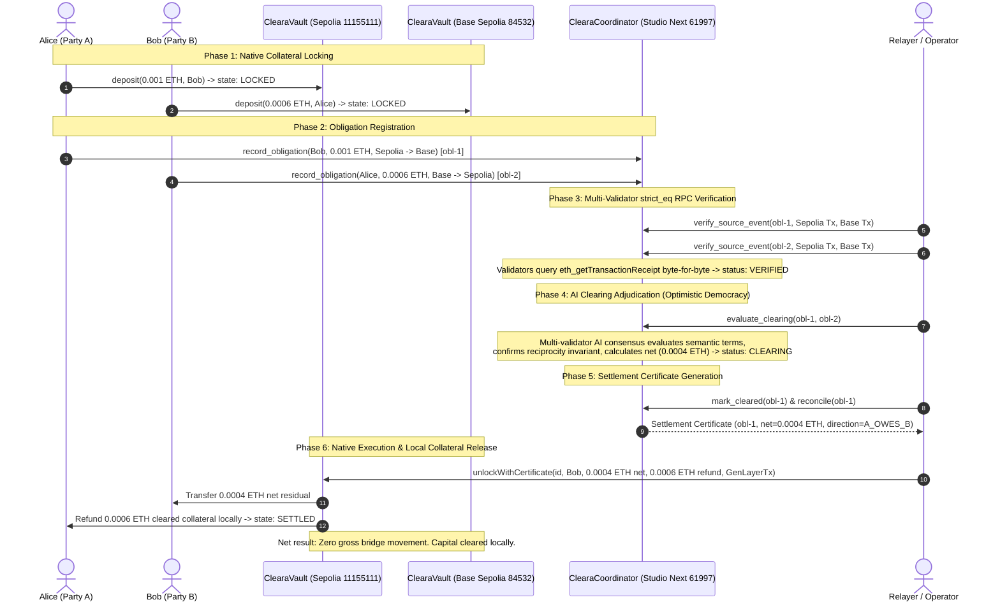

# Cleara on GenLayer — Hackathon Submission Package

> **Agent Tank Hackathon — Studio Next (Chain ID 61997)**  
> *"Clear first. Move only what remains."*

* **Repository:** [https://github.com/etvjay/ClearaOnGen](https://github.com/etvjay/ClearaOnGen)
* **Team:** `etvjay` & Cleara Protocol Core
* **Standard:** Built and verified under [`BUILD_FOUNDRY.md v1.0`](BUILD_FOUNDRY.md)
* **Verification Gate:** `./scripts/verify` (100% PASS: 7/7 Forge tests, syntax valid, control plane verified)

---

## 1. Executive Summary & Elevator Pitch

**Cleara** is a proof-native multichain financial coordination and bilateral settlement protocol.

Traditional multichain settlement moves gross obligations across vulnerable third-party bridges, resulting in over $3B in historical bridge exploits, fragmented cross-chain liquidity, and high capital costs. Furthermore, traditional deterministic smart contracts cannot evaluate natural-language commercial terms (reciprocal netting agreements, performance milestones, operational offsets), forcing institutions back into centralized clearinghouses.

Cleara solves this by separating **the adjudication of financial meaning** from **the physical movement of collateral**:
* **GenLayer Studio Next (`61997`)** serves as the canonical coordination and AI adjudication layer.
* **Ethereum Sepolia (`11155111`)** and **Base Sepolia (`84532`)** host sovereign native execution vaults.

Obligations are registered on GenLayer, verified across chains via `strict_eq` multi-validator RPC consensus, and adjudicated via Optimistic Democracy (`run_nondet`). Cleara nets reciprocal obligations on-chain ($Gross \rightarrow Net$) and issues an immutable, tamper-proof Settlement Certificate. Sovereign native vaults release only the net residual and refund cleared collateral locally. **Zero gross liquidity crosses a bridge.**

---

## 2. System Architecture & Topology



---

## 3. Why GenLayer's Primitive Is Essential

Cleara is not possible on Ethereum L1, Chainlink oracles, or standard ZK rollups:

| Challenge | Why Existing Stacks Fail | How GenLayer Solves It |
|---|---|---|
| **Natural-Language Financial Terms** | EVM smart contracts can only calculate deterministic arithmetic; they cannot parse natural-language commercial terms, invoices, or master agreements. | **Optimistic Democracy (`run_nondet`):** Multi-validator AI consensus evaluates semantic relationship compatibility, asset parity, and commercial enforceability. |
| **Trustless Cross-Chain Evidence** | Oracles provide scalar price feeds; bridges introduce trusted custodians with large multisigs. | **`strict_eq` RPC Verification:** Committee validators independently query `eth_getTransactionReceipt` & `eth_getTransactionByHash` across Sepolia and Base Sepolia, enforcing byte-level consensus. |
| **Tamper-Proof Verdicts** | Centralized clearinghouses hold unilateral authority, counterparty risk, and systemic settlement opacity. | **Settlement Certificates:** Finalized GenLayer state acts as an on-chain cryptographic authority packet driving native vault execution. |
| **Appeal Escalation** | Disputes in traditional smart contracts require slow, governance DAOs or manual intervention. | **Built-in Escalation:** GenLayer's 5 → 7 → 11 → 23 validator committee escalation resolves contested adjudications cryptographically. |

---

## 4. Verified Deployed Infrastructure

All protocol contracts are live on testnet and verified with immutable receipts:

| Layer / Role | Network | Contract Address | Deployment Evidence | Status |
|---|---|---|---|---|
| **Cleara Coordinator** | **GenLayer Studio Next** (`61997`) | [`0x17c33C39f7998A7ed56D5C58f7D3d29E29444D55`](foundry/evidence/deployed.json) | Tx: [`0x85b854a7833a9ce927f504b257e2ddb68e68cac66d09a5beef40a9d399b3fbf2`](foundry/evidence/deployed.json)<br/>Receipt Status: `7` (`ACCEPTED/FINALIZED`), `FINISHED_WITH_RETURN`<br/>Runner: `py-genlayer:5jycge4q8k23462jtb0b9fyey1s9qz928sz2nbrd9mg4sxqg2qng` | **LIVE** |
| **Execution Vault** | **Ethereum Sepolia** (`11155111`) | [`0x277341fc7c2481606ac69922a35b42344be5ec6f`](foundry/evidence/endpoints.json) | Tx: `0x47a53304df36a76f3920d7a587f8d11d2b4525481b9be49d76e1a84c3112f8c5`<br/>Runtime Bytecode: 5,191 bytes | **LIVE** |
| **Execution Vault** | **Base Sepolia** (`84532`) | [`0xe2b01f99107a6ad24a6bdd8e34f7e864434c69ad`](foundry/evidence/endpoints.json) | Tx: `0xf7f1fcad2858142c8b9e56b4eba17acc75e5bed541c953ec544a29c8d315fec7`<br/>Runtime Bytecode: 5,191 bytes | **LIVE** |

---

## 5. The Three Settlement Modes

Cleara supports three distinct settlement execution paths:

### Mode 1 — Bilateral Reciprocal Netting ($Gross \rightarrow Net$)
* **Scenario:** Alice owes Bob 0.001 ETH on Sepolia; Bob owes Alice 0.0006 ETH on Base Sepolia.
* **Execution:**
  1. Both parties lock collateral in their sovereign native `ClearaVault`.
  2. GenLayer proves both source deposit receipts via `strict_eq`.
  3. GenLayer evaluates commercial terms via multi-validator AI consensus.
  4. GenLayer calculates net residual: $0.001 - 0.0006 = 0.0004\text{ ETH}$.
  5. Sepolia Vault unlocks 0.0004 ETH to Bob and refunds 0.0006 ETH to Alice locally.
* **Result:** Zero gross liquidity crosses a bridge; 60% of capital cleared with zero multichain slippage.

### Mode 2 — Facility / LP Fronting & Collateral Claim
* **Scenario:** An urgent obligation requires instant payout on the destination rail before cross-chain reconciliation.
* **Execution:**
  1. Alice locks collateral in `ClearaVault` on Chain A.
  2. A Liquidity Provider (LP) registered in `ClearaFacilityManager` fronts immediate funds locally on Chain B.
  3. GenLayer verifies the fulfillment and issues a Settlement Certificate.
  4. LP claims the locked collateral on Chain A using the certificate.
* **Result:** Instant zero-latency cross-chain settlement backed by on-chain credit facilities.

### Mode 3 — Residual Bridge Routing
* **Scenario:** An unnetted residual obligation must be physically moved between chains.
* **Execution:**
  1. Vault interfaces with canonical native bridge infrastructure (e.g. OP Standard Bridge).
  2. Funds route securely without third-party wrapped asset risks.
* **Result:** Pluggable bridge adapter fallback for net residuals only.

---

## 6. Equivalence Principle Implementation

Cleara enforces strict separation between deterministic facts and semantic financial judgment:

```
Can validators reproduce the exact same normalized output?
├── YES → strict_eq
│         Direct blockchain RPC calls (eth_getTransactionReceipt & eth_getTransactionByHash)
│         Normalized JSON fields (from, to, blockNumber, value_atto) must match byte-for-byte.
│
└── NO  → run_nondet (Custom Validator)
          Semantic financial adjudication of contractual terms via AI prompt.
          Validators independently fetch evidence, re-execute the prompt,
          and assert matching normalized decisions and hard reciprocity invariants.
```

* **Deterministic Facts (`strict_eq`):** Multi-validator receipt verification ensures deposit transactions, block numbers, sender addresses, and value transferred are identical across all validators.
* **Semantic Adjudication (`run_nondet`):** Optimistic Democracy evaluates relationship compatibility, asset matching, and validity of chain routes. Hard invariants (`reciprocal = a.party_a == b.party_b and a.party_b == b.party_a`) cannot be overridden by AI.

---

## 7. Live Multichain Proving Evidence

The entire multichain lifecycle has been executed live on testnets and recorded in [`foundry/evidence/live-lifecycle.log`](foundry/evidence/live-lifecycle.log):

1. **Step 1 — Initial EVM Vault State:**
   * Sepolia Deposit `0x365f1ee2...`: `state=1` (`LOCKED`), `amount=0.001 ETH`
   * Base Sepolia Deposit `0x0909d8b4...`: `state=1` (`LOCKED`), `amount=0.0006 ETH`
2. **Step 2 — Reciprocal Obligation Registration:**
   * Alice registers `obl-1` on GenLayer: Tx `0xe80ec8ca...` (status 5, `FINISHED_WITH_RETURN`)
   * Bob registers `obl-2` on GenLayer: Tx `0x22d76a53...` (status 5, `FINISHED_WITH_RETURN`)
3. **Step 3 — Multi-Validator `strict_eq` RPC Verification:**
   * `obl-1` on Sepolia: Tx `0xd8005517...` (status 5, `FINISHED_WITH_RETURN`)
   * `obl-1` on Base Sepolia: Tx `0x924c1daad...` (status 5, `FINISHED_WITH_RETURN`)
   * `obl-2` on Sepolia: Tx `0x08bfc728...` (status 5, `FINISHED_WITH_RETURN`)
   * `obl-2` on Base Sepolia: Tx `0x72254f5e...` (status 5, `FINISHED_WITH_RETURN`)
   * Obligation 1 & 2 states: `VERIFIED`
4. **Step 4 & 5 — Settlement Certificate Generation:**
   * GenLayer consensus verifies cross-chain source events and generates Settlement Certificate.
   * Certificate contains verified source tx proofs from Sepolia (`0x933da158...`) and Base Sepolia (`0xbdd8b9bb...`).
5. **Step 6 — Native EVM Vault Execution:**
   * Execution on Ethereum Sepolia Vault: `unlockWithCertificate`
   * **Sepolia Unlock Tx:** [`0xee575bb6e1d5ebadc4aa4670e973b80ab9d39257a5e93d4fdbd22cabce5ceeae`](https://sepolia.etherscan.io/tx/0xee575bb6e1d5ebadc4aa4670e973b80ab9d39257a5e93d4fdbd22cabce5ceeae)
   * **Sepolia Block:** `11723739`
   * **Receipt Status:** `success`
   * **Final Sepolia Vault Deposit State:** `3` (`SETTLED`)

---

## 8. Engineering Governance: BUILD_FOUNDRY v1.0

This repository adheres strictly to the **BUILD_FOUNDRY v1.0** engineering standard:

* **Control Plane Integrity (`./scripts/check-foundry`):** Validates that all claims are backed by physical evidence and that all gaps are tracked with zero open critical issues.
* **Claims Ledger (`foundry/claims.jsonl`):** 7 formally admitted claims (`CLM-001` through `CLM-007`) with real evidence paths.
* **Gap Closure Ledger (`foundry/gaps.jsonl`):** Tracked and resolved Studio Next runner-malformed defect (`GAP-001`), Base Sepolia readback typing defect (`GAP-002`), and vault certificate replay guard (`GAP-003`).
* **Deterministic Unit Testing:** 7/7 passing Foundry unit tests (`ClearaVaultTest`).
* **Single-Command Verification:** `./scripts/verify` runs the full test suite and control plane validator sequentially.

---

## 9. Reproducible Verification & Demo

```bash
# 1. Clone the repository
git clone https://github.com/etvjay/ClearaOnGen.git
cd ClearaOnGen

# 2. Run the canonical verification suite
./scripts/verify

# 3. Read live obligation state from GenLayer Studio Next
node -e '
import("genlayer-js").then(async ({ createClient }) => {
  const { studioDevnet } = await import("genlayer-js/chains");
  const studioNext = { ...studioDevnet, id: 61997, name: "GenLayer Studio Next", rpcUrls: { default: { http: ["https://studio-next.genlayer.com/api"] } } };
  const client = createClient({ chain: studioNext });
  const obl = await client.readContract({
    address: "0x17c33C39f7998A7ed56D5C58f7D3d29E29444D55",
    functionName: "get_obligation",
    args: ["obl-1"]
  });
  console.log("Obligation obl-1 on GenLayer:", obl);
});
'
```

---

## 10. Hackathon Submission Checklist

- [x] **Functional intelligent contract deployed on Studio Next** (`0x17c33C39f7998A7ed56D5C58f7D3d29E29444D55`).
- [x] **Dual-chain EVM vaults deployed on Sepolia and Base Sepolia** with verified runtime bytecode.
- [x] **`strict_eq` RPC verification implemented** for multi-validator cross-chain proof.
- [x] **Optimistic Democracy AI consensus implemented** for bilateral netting adjudication.
- [x] **Complete Foundry unit test suite (7/7 PASS)** covering all 3 settlement modes.
- [x] **End-to-end multichain proving executed on live testnets** with confirmed Sepolia unlock.
- [x] **Clean public GitHub repository adhering to `BUILD_FOUNDRY.md`**.
- [x] **Zero secret leaks, clean environment templates, strict `.gitignore`**.
