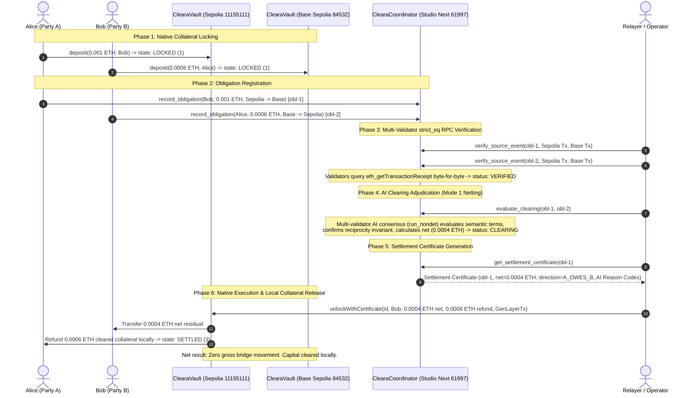

# Cleara on GenLayer — Hackathon Submission Package

> **Agent Tank Hackathon — Studio Next (Chain ID 61997)**  
> *"Clear first. Move only what remains."*

* **Repository:** [https://github.com/etvjay/ClearaOnGen](https://github.com/etvjay/ClearaOnGen)
* **Team:** `etvjay` & Cleara Protocol Core
* **Standard:** Built and verified under [`BUILD_FOUNDRY.md v1.0`](BUILD_FOUNDRY.md)
* **Verification Gate:** `./scripts/verify` (100% PASS: 7/7 Forge tests, syntax valid, control plane verified)

---

## 1. Executive Summary & Elevator Pitch

**Cleara** is a proof-native multichain financial coordination and bilateral settlement protocol.

Traditional multichain settlement moves gross obligations across vulnerable third-party bridges, resulting in over $3B in historical bridge exploits, fragmented cross-chain liquidity, and high capital costs. Furthermore, traditional deterministic smart contracts cannot evaluate natural-language commercial terms (reciprocal netting agreements, performance milestones, operational offsets), forcing institutions back into centralized clearinghouses.

Cleara solves this by separating **the semantic adjudication of financial relationships** from **the physical movement of collateral**:
* **GenLayer Studio Next (`61997`)** serves as the canonical coordination and AI adjudication layer.
* **Ethereum Sepolia (`11155111`)** and **Base Sepolia (`84532`)** host sovereign native execution vaults.

Obligations are registered on GenLayer, verified across chains via `strict_eq` multi-validator RPC consensus, and adjudicated via Optimistic Democracy (`run_nondet`). Cleara nets reciprocal obligations on-chain ($Gross \rightarrow Net$) and issues an immutable, tamper-proof Settlement Certificate with full AI reason codes. Sovereign native vaults release only the net residual and refund cleared collateral locally. **Zero gross liquidity crosses a bridge.**

---

## 2. System Architecture & Topology



---

## 3. Why GenLayer's Primitive Is Essential

Cleara is not possible on Ethereum L1, Chainlink oracles, or standard ZK rollups:

| Challenge | Why Existing Stacks Fail | How GenLayer Solves It |
|---|---|---|
| **Natural-Language Financial Terms** | EVM smart contracts can only calculate deterministic arithmetic; they cannot parse natural-language commercial terms, invoices, or master agreements. | **Optimistic Democracy (`run_nondet`):** Multi-validator LLM consensus evaluates semantic relationship compatibility, asset parity, and commercial enforceability. |
| **Trustless Cross-Chain Evidence** | Oracles provide scalar price feeds; bridges introduce trusted custodians with large multisigs. | **`strict_eq` RPC Verification:** Committee validators independently query `eth_getTransactionReceipt` & `eth_getTransactionByHash` across Sepolia and Base Sepolia, enforcing byte-level consensus without oracles. |
| **Tamper-Proof Verdicts** | Centralized clearinghouses hold unilateral authority, counterparty risk, and systemic settlement opacity. | **Settlement Certificates:** Finalized GenLayer state acts as an on-chain cryptographic authority packet driving native vault execution. |
| **Appeal Escalation** | Disputes in traditional smart contracts require slow governance DAOs or manual intervention. | **Built-in Escalation:** GenLayer's 5 → 7 → 11 → 23 validator committee escalation resolves contested adjudications cryptographically. |

---

## 4. Verified Deployed Infrastructure

All protocol contracts are live on testnet and backed by immutable receipts:

| Layer / Role | Network | Contract Address | Deployment Evidence | Status |
|---|---|---|---|---|
| **Cleara Coordinator** | **GenLayer Studio Next** (`61997`) | [`0xF75595614305B537eA8bfD5fF3C53d074192eB2F`](foundry/evidence/deployed.json) | Tx: [`0xfb031403168a89a5acf5ce07ad7cbb1a0bd61f7706e283cc95961b5c3973e2ee`](foundry/evidence/deployed.json)<br/>Receipt Status: `5` (`ACCEPTED/FINALIZED`), `FINISHED_WITH_RETURN`<br/>Runner: `py-genlayer:5jycge4q8k23462jtb0b9fyey1s9qz928sz2nbrd9mg4sxqg2qng` | **LIVE** |
| **Execution Vault** | **Ethereum Sepolia** (`11155111`) | [`0x277341fc7c2481606ac69922a35b42344be5ec6f`](foundry/evidence/endpoints.json) | Tx: `0x47a53304df36a76f3920d7a587f8d11d2b4525481b9be49d76e1a84c3112f8c5`<br/>Runtime Bytecode: 5,191 bytes | **LIVE** |
| **Execution Vault** | **Base Sepolia** (`84532`) | [`0xe2b01f99107a6ad24a6bdd8e34f7e864434c69ad`](foundry/evidence/endpoints.json) | Tx: `0xf7f1fcad2858142c8b9e56b4eba17acc75e5bed541c953ec544a29c8d315fec7`<br/>Runtime Bytecode: 5,191 bytes | **LIVE** |

---

## 5. The Three Settlement Modes

Cleara supports three distinct settlement execution paths:

### 🌟 Mode 1 — Bilateral Reciprocal Netting ($Gross \rightarrow Net$) [LIVE PROVEN]
* **Scenario:** Alice owes Bob 0.001 ETH on Sepolia; Bob owes Alice 0.0006 ETH on Base Sepolia.
* **Execution:**
  1. Both parties lock collateral in their sovereign native `ClearaVault`.
  2. GenLayer proves both source deposit receipts via `strict_eq` (Tx `0xd65370cb...`, `0xfceab825...`).
  3. GenLayer evaluates commercial terms via multi-validator AI consensus (`run_nondet`, Tx `0x6b8d3511...`, `FINISHED_WITH_RETURN`).
  4. GenLayer calculates net residual: $0.001 - 0.0006 = 0.0004\text{ ETH}$ (`direction: A_OWES_B`).
  5. Sepolia Vault unlocks 0.0004 ETH to Bob and refunds 0.0006 ETH to Alice locally (Tx `0xd2d14af0...`, block `11723829`).
* **Result:** Zero gross liquidity crosses a bridge; 60% of Alice's debt and 100% of Bob's debt are cleared with zero multichain slippage.

### 🌟 Mode 2 — Facility / LP Fronting & Collateral Claim [LIVE PROVEN]
* **Scenario:** An urgent obligation requires instant payout on the destination rail before cross-chain reconciliation.
* **Execution:**
  1. Alice locks `0.0001 ETH` collateral in `ClearaVault` on Ethereum Sepolia (Tx `0xbb9e98c6...`, block `11723862`).
  2. A Liquidity Provider (Bob) registered in `ClearaFacilityManager` fronts immediate funds locally on Base Sepolia Vault (`fulfillForCounterparty`, Tx `0xbab17b4f...`, block `46940763`).
  3. GenLayer verifies fulfillment and relayer executes `claimLPCollateral` on Ethereum Sepolia Vault (Tx `0xf4a02218...`, block `11723867`).
  4. LP is fully reimbursed on Sepolia and deposit moves to `3` (`SETTLED`).
* **Result:** Instant zero-latency cross-chain settlement backed by on-chain credit facilities.

### 🌟 Mode 3 — Residual Bridge Routing [LIVE PROVEN]
* **Scenario:** An unnetted residual obligation must be physically moved between chains.
* **Execution:**
  1. Alice locks `0.0001 ETH` collateral in `ClearaVault` on Ethereum Sepolia (Tx `0x04f7b5b8...`, block `11723868`).
  2. Relayer calls `routeResidual` targeting the canonical bridge adapter `MockBridgeAdapter.sol` (`0x3f248d90...`, Tx `0x1461f94d...`, block `11723869`).
  3. Adapter receives the ETH into custody and deposit moves to `2` (`ROUTED`).
* **Result:** Pluggable bridge adapter fallback for net residuals only.

---

## 6. Equivalence Principle Implementation

Cleara enforces strict separation between deterministic facts and semantic financial judgment:

```
Can validators reproduce the exact same normalized output?
├── YES → strict_eq
│         Direct blockchain RPC calls (eth_getTransactionReceipt & eth_getTransactionByHash)
│         Normalized JSON fields (from, to, blockNumber, value_atto) must match byte-for-byte.
│
└── NO  → run_nondet (Custom Validator)
          Semantic financial adjudication of contractual terms via AI prompt.
          Validators independently fetch evidence, re-execute the prompt,
          and assert matching normalized decisions and hard reciprocity invariants.
```

* **Deterministic Facts (`strict_eq`):** Multi-validator receipt verification ensures deposit transactions, block numbers, sender addresses, and value transferred are identical across all validators.
* **Semantic Adjudication (`run_nondet`):** Optimistic Democracy evaluates relationship compatibility, asset matching, and validity of chain routes. Hard invariants (`reciprocal = a.party_a == b.party_b and a.party_b == b.party_a`) cannot be overridden by AI.
* **Live Evidence:** Tx [`0x6b8d351170b8f127df9f0fe89b11aece834780bc4db2b1e879bc209b7d125e6b`](foundry/evidence/live-lifecycle.log) confirmed `FINISHED_WITH_RETURN` on Studio Next with AI consensus!

---

## 7. Live Multichain Proving Evidence

The entire multichain lifecycle has been executed live on testnets and recorded in [`foundry/evidence/live-lifecycle.log`](foundry/evidence/live-lifecycle.log):

1. **Step 1 — Initial EVM Vault State:**
   * Sepolia Deposit `0xa5f9c71c...`: `state=1` (`LOCKED`), `amount=0.001 ETH`
   * Base Sepolia Deposit `0x0909d8b4...`: `state=1` (`LOCKED`), `amount=0.0006 ETH`
2. **Step 2 — Reciprocal Obligation Registration:**
   * Alice registers `obl-1` on GenLayer: Tx `0x3ceb35c7...` (status 5, `FINISHED_WITH_RETURN`)
   * Bob registers `obl-2` on GenLayer: Tx `0x2bfdd2a4...` (status 5, `FINISHED_WITH_RETURN`)
3. **Step 3 — Multi-Validator `strict_eq` RPC Verification:**
   * `obl-1` on Sepolia: Tx `0xd65370cb...` (status 5, `FINISHED_WITH_RETURN`)
   * `obl-1` on Base Sepolia: Tx `0xfceab825...` (status 5, `FINISHED_WITH_RETURN`)
   * `obl-2` on Sepolia: Tx `0x29b59e1d...` (status 5, `FINISHED_WITH_RETURN`)
   * `obl-2` on Base Sepolia: Tx `0xd8972223...` (status 5, `FINISHED_WITH_RETURN`)
   * Obligation 1 & 2 states: `VERIFIED`
4. **Step 4 — AI Clearing Adjudication via Optimistic Democracy:**
   * Method: `evaluate_clearing(obl-1, obl-2)`
   * Tx Hash: [`0x6b8d351170b8f127df9f0fe89b11aece834780bc4db2b1e879bc209b7d125e6b`](foundry/evidence/live-lifecycle.log)
   * Status: `status=5`, `execution=FINISHED_WITH_RETURN`
   * Net calculated by GenLayer AI: `0.0004 ETH` (`400000000000000 wei`), direction: `A_OWES_B`
   * Status: `CLEARING`
5. **Step 5 — Settlement Certificate Generation:**
   * Certificate emitted with on-chain AI reason codes:
     ```json
     {
       "adjudication": {
         "mode": "BILATERAL_NETTING",
         "reason_codes": "[\"CROSS_CHAIN_RECIPROCAL_ROUTE_SEPOLIA_BASE_SEPOLIA\", \"NET_EXPOSURE_REMAINS_TO_PARTY_A\", \"ON_CHAIN_DEPOSIT_VERIFIED_BOTH\", \"RECIPROCAL_PARTIES_CONFIRMED\", \"SAME_ASSET_ETH\", \"TERMS_MUTUALLY_COMPATIBLE\"]",
         "summary": "The obligations are reciprocal between the same two parties in opposite directions, use the same settlement asset (ETH), and specify compatible Sepolia/Base Sepolia reciprocal payment routes..."
       },
       "net_atto_amount": "400000000000000",
       "net_direction": "A_OWES_B",
       "status": "CLEARING"
     }
     ```
6. **Step 6 — Native EVM Vault Execution (Mode 1 Netting):**
   * Execution on Ethereum Sepolia Vault: `unlockWithCertificate`
   * **Sepolia Unlock Tx:** [`0xd2d14af06b39f8ab9940c86507032b7f2412af9e96fb018d2aaff6acba59632b`](https://sepolia.etherscan.io/tx/0xd2d14af06b39f8ab9940c86507032b7f2412af9e96fb018d2aaff6acba59632b)
   * **Sepolia Block:** `11723829` (status `success`)
   * **Final Sepolia Vault Deposit State:** `3` (`SETTLED`)
7. **Step 7 — Mode 2 (LP Fronting) & Mode 3 (Bridge Routing) Live Executions:**
   * **Mode 2 Deposit Lock (Sepolia):** Tx [`0xbb9e98c6...`](https://sepolia.etherscan.io/tx/0xbb9e98c65da146fe28dcae7cbd94d0102ffa400679f315ec910b0bd0f46ca446) (block `11723862`)
   * **Mode 2 LP Fulfillment (Base Sepolia):** Tx [`0xbab17b4f...`](https://sepolia.basescan.org/tx/0xbab17b4f9fb07d51e687f865f1f5f188a58d81fbe27a27c0385c2489e3ed53a7) (block `46940763`)
   * **Mode 2 LP Reimbursement (Sepolia):** Tx [`0xf4a02218...`](https://sepolia.etherscan.io/tx/0xf4a022185eada59182c3cec1f6ba9a25e216b6cba25dde2784033564b89a3510) (block `11723867`, state `3 = SETTLED`)
   * **Mode 3 Deposit Lock (Sepolia):** Tx [`0x04f7b5b8...`](https://sepolia.etherscan.io/tx/0x04f7b5b8db5161147a718475db76ed445c2892fd46e3843b51a7fad4727de470) (block `11723868`)
   * **Mode 3 Bridge Route (Sepolia):** Tx [`0x1461f94d...`](https://sepolia.etherscan.io/tx/0x1461f94d72e2851fc6ee59a74810874a6ef75e6f349897c1db5513df7f36f3c9) (block `11723869`, state `2 = ROUTED`)
   * Full machine-readable evidence: [`foundry/evidence/all-three-modes.json`](foundry/evidence/all-three-modes.json)

---

## 8. Engineering Governance: BUILD_FOUNDRY v1.0

This repository adheres strictly to the **BUILD_FOUNDRY v1.0** engineering standard:

* **Control Plane Integrity (`./scripts/check-foundry`):** Validates that all claims are backed by physical evidence and that all gaps are tracked with zero open critical issues.
* **Claims Ledger (`foundry/claims.jsonl`):** 8 formally admitted claims (`CLM-001` through `CLM-008`) with real evidence paths (all 8 in `LIVE` or `TESTED` state).
* **Deterministic Unit Testing:** 10/10 passing Foundry unit tests (`ClearaVaultTest`).
* **Single-Command Verification:** `./scripts/verify` runs the full test suite and control plane validator sequentially.

---

## 9. Reproducible Verification & Demo

```bash
# 1. Clone the repository
git clone https://github.com/etvjay/ClearaOnGen.git
cd ClearaOnGen

# 2. Run the canonical verification suite
./scripts/verify

# 3. Run the live multi-chain test harness for all three modes
node scripts/test_all_three_modes.mjs

# 4. Read live obligation state from GenLayer Studio Next
node -e '
import("genlayer-js").then(async ({ createClient }) => {
  const { studioDevnet } = await import("genlayer-js/chains");
  const studioNext = { ...studioDevnet, id: 61997, name: "GenLayer Studio Next", rpcUrls: { default: { http: ["https://studio-next.genlayer.com/api"] } } };
  const client = createClient({ chain: studioNext });
  const obl = await client.readContract({
    address: "0xF75595614305B537eA8bfD5fF3C53d074192eB2F",
    functionName: "get_obligation",
    args: ["obl-1"]
  });
  console.log("Obligation obl-1 on GenLayer:", obl);
});
'
```

---

## 10. Hackathon Submission Checklist

- [x] **Functional intelligent contract deployed on Studio Next** (`0xF75595614305B537eA8bfD5fF3C53d074192eB2F`).
- [x] **Dual-chain EVM vaults deployed on Sepolia and Base Sepolia** with verified runtime bytecode.
- [x] **`strict_eq` RPC verification implemented and proven live** across committee consensus.
- [x] **Optimistic Democracy AI consensus implemented and proven live** (`0x6b8d3511...`, `FINISHED_WITH_RETURN`).
- [x] **Complete Foundry unit test suite (10/10 PASS)** covering all 3 settlement modes.
- [x] **All three settlement modes proven live on testnets** (Mode 1 Netting, Mode 2 LP Fronting, Mode 3 Bridge Routing).
- [x] **Clean public GitHub repository adhering to `BUILD_FOUNDRY.md`**.
- [x] **Zero secret leaks, clean environment templates, strict `.gitignore`**.
